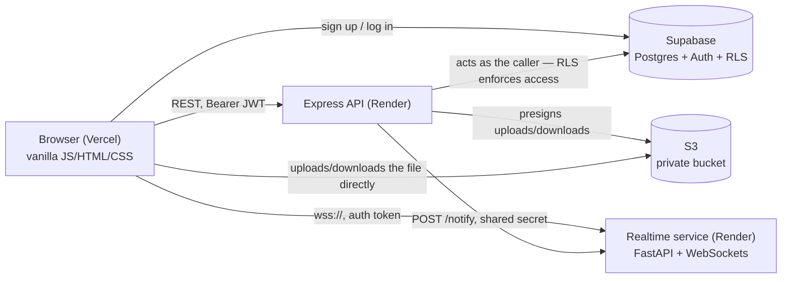

# classroom-portal

A small full-stack classroom management app: a teacher posts a class and an assignment, a student
joins and submits, and the teacher sees it arrive live — no page refresh. Built to demonstrate a
typical small-team EdTech stack end to end: a JS frontend, an API service, a Postgres database with
row-level security as the real access-control layer, a separate real-time service, and cloud file
storage, deployed as independent services rather than one monolith.

**Live demo:** https://classroom-portal-three.vercel.app — sign up as a teacher or a student to try it.

## Architecture



## Why this stack
- **Vanilla JS, no framework.** At this scope a framework would add build tooling without adding
  capability — the app is a handful of views and fetch calls, and plain DOM/fetch code shows that
  directly rather than through an abstraction.
- **Express.** Straightforward middleware and routing for a small REST API: role checks, input
  validation, and three write paths that all need the same ownership rules enforced consistently.
- **Supabase (Postgres + Auth + Row Level Security).** Access control lives in the database itself,
  not just in application code — a teacher can only ever read/write their own classes, a student
  only their own enrollments and submissions, enforced by policies Postgres checks on every query,
  regardless of which service is asking.
- **A separate Python/FastAPI service for real-time.** A second language and a different protocol
  (WebSockets, not request/response) for the one feature that genuinely needs a persistent
  connection, rather than bolting sockets onto the REST API.
- **S3, accessed only through presigned URLs.** Files never pass through the API server — the
  browser uploads and downloads directly against a private bucket, and the API's only job is
  deciding, per request, whether this user is allowed to do that.
- **Two platforms, three deployed services.** Vercel for the static frontend, two independent
  services on Render for the API and the realtime server — a small, realistic version of how a
  team actually splits a system instead of running everything in one process.

## What it demonstrates

| Built | Real-world pattern |
|---|---|
| Role-based Postgres RLS (teacher/student) | Access control enforced at the database layer, not just in application code |
| Live WebSocket notifications | Real-time alerts — e.g. a teacher seeing a submission the instant it lands |
| Presigned S3 uploads/downloads | The standard pattern for user-uploaded files at any real scale |
| Class join codes | Self-service enrollment, Google-Classroom-style |
| Two backend services on two platforms | How a small team actually splits a system, rather than one monolith |

## Layout
- `frontend/` — vanilla JS/HTML/CSS (Vercel)
- `api/` — Express accounts/API service (Render)
- `realtime/` — Python (FastAPI) websocket service that pushes live notifications (Render)
- `supabase/` — SQL migrations and schema notes
- S3 (private bucket) — assignment attachments and submission files. Nothing in it is public: the API
  checks who's asking and hands out short-lived presigned URLs, and browsers upload and download
  directly against S3, so file bytes never pass through Express (setup: `docs/AWS_S3_SETUP.md`)
- `docs/` — project brief and session notes

## Run everything locally
Three processes, each in its own terminal:
```sh
cd api && npm run dev                                            # API          :3000  (see api/README.md)
cd realtime && .venv/bin/uvicorn main:app --port 8001 --env-file .env   # realtime :8001  (see realtime/README.md)
cd frontend && python3 -m http.server 8000                       # frontend     :8000
```
Then open http://localhost:8000. The realtime service is optional: without it everything
works except the teacher's live notifications. File uploads are optional too: they need an
S3 bucket, set up per [`docs/AWS_S3_SETUP.md`](docs/AWS_S3_SETUP.md).

The dashboards call the API at `API_URL` and the realtime service at `REALTIME_WS_URL`
(both in `frontend/js/config.js`). The API only accepts browser requests from
`http://localhost:8000` by default (`CORS_ORIGIN`).

## Known simplifications
Deliberate scope cuts for a demo, not oversights:

- **Anyone can pick "Teacher" at signup.** The brief has the user choose their role, so the signup
  trigger honors it. A real deployment would gate teacher accounts (invites, an allowlist, or
  admin approval).
- **Enrolled students can see the join code.** RLS lets a student read their class row, and the
  code is a column on it, so a student can pass it on. Google Classroom works the same way;
  rotating codes or hiding the column would tighten it.
- **The join rate limit lives in server memory.** Failed join attempts are capped per user, but
  the counter resets on restart and isn't shared between instances. Fine for one Render
  service; scaling out would need a shared store such as Redis.
- **No late-submission handling, and no deleting classes or assignments.** Grading and deadline
  enforcement are non-goals, so `due_date` is informational and late work is accepted
  unflagged. There are no delete routes or buttons (RLS would let a teacher delete their own
  classes and assignments, but nothing exposes it).
- **Live notifications use an in-memory registry and are best-effort.** The realtime service
  tracks connected teachers in a process-local dict, so a restart drops every connection (browsers
  reconnect on their own) and a second instance would split teachers between processes; scaling out
  needs a shared pub/sub such as Redis. Nothing is queued: if a teacher is offline, or the service is
  down when a student submits, that push is simply missed. The submission itself is always saved, and
  the dashboard's Refresh (or a reconnect) shows it.
- **The WebSocket token is only verified when the connection opens.** A tab left open past the
  token's expiry (about an hour) stays connected and keeps receiving pushes until it next
  reconnects, which authenticates with a fresh token. The stream only ever carries that teacher's
  own notifications, so re-checking mid-connection wasn't worth the complexity for a demo.
- **Resubmissions trigger the same toast as first submissions.** A submission is an upsert, so the
  API can't tell a new one from a replacement, and the teacher sees an identical notification for both.
- **File limits are fixed and small.** One file per assignment and one per submission, at most 5 MB, and
  only PDF, plain text, PNG, JPEG or Word (.docx): no zips, slides, video, or multi-file, chunked or
  resumable uploads. The limits are constants in `api/src/files.js`, and S3 enforces the same cap and
  type through the signed upload policy. A download whose object is missing lands on S3's own error
  page rather than an in-app message.
- **File uploads: no cleanup and no quota.** Replaced or abandoned files (for example, an upload whose
  assignment failed to post) stay in the bucket, and a signed-in user can upload up to the size cap
  repeatedly. Deleting a class or assignment doesn't delete its files either. Per-user quotas, S3
  lifecycle rules, and object deletion are what you'd add; a budget alert covers it for a demo.
- **Uploaded file types are trusted by declaration.** S3 enforces the content type the API signed, but
  that comes from the browser, and nothing scans or sniffs the bytes. Downloads are forced to
  `attachment` so a file is never rendered inline, and the allowlist is small (PDF, text, PNG, JPEG, docx).
- **A student can't remove a submitted file, only replace it.** Resubmitting without choosing a file keeps
  the existing one.
- **CORS is scoped to the production URL only, not Vercel's preview deployments.** This project has
  no PR/branch-preview workflow, so a preview deployment's dynamic subdomain simply can't call the API;
  only `main`'s production URL is allowed.

## License
MIT — see [`LICENSE`](LICENSE).
